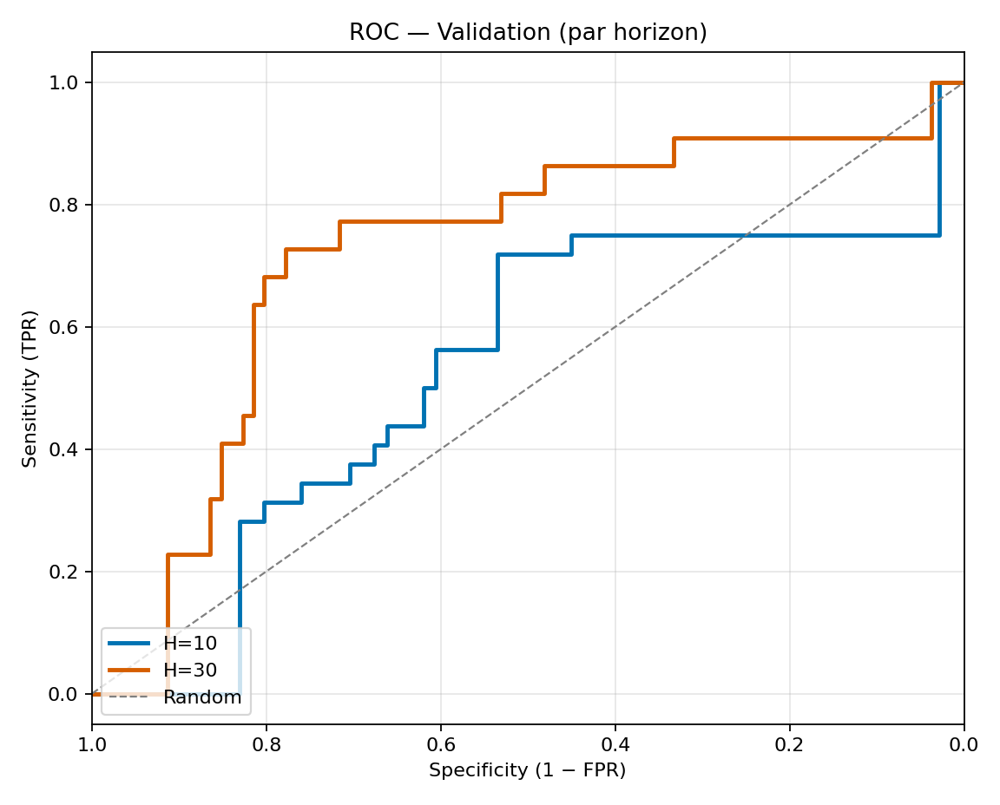

# ML Volatility Trading Using Long and Short Straddles

Ce projet a été réalisé dans le cadre du cours **Méthodes d’apprentissage appliquées aux données financières (MATH 60610)** à HEC Montréal.

L’objectif est de prévoir l’écart entre la volatilité implicite et la volatilité réalisée du S&P 500 sur des horizons de **10, 30 et 60 jours**, puis d’utiliser ces prévisions pour générer des signaux **long, short ou neutres** sur des straddles ATM.

Le pipeline combine plusieurs méthodes d’apprentissage automatique, notamment **CatBoost, Ridge, Random Forest, SVR, régression logistique calibrée et K-means**. Les variables explicatives proviennent du SPX, du marché des options, de la structure de volatilité et de plusieurs indicateurs macroéconomiques.

Les modèles sont entraînés et validés sur la période **2010–2018**, puis la stratégie est évaluée hors échantillon entre **2018 et 2023**.

## Résultats

### Backtest hors échantillon

Les performances obtenues avec la version actuelle du pipeline sont :

| Horizon | Valeur finale | CAGR | Sharpe | Max drawdown |
|---|---:|---:|---:|---:|
| 10 jours | 0.895x | -2.20% | 0.08 | -55.00% |
| 30 jours | 0.914x | -1.80% | -0.00 | -37.09% |
| 60 jours | 1.232x | 4.28% | 0.36 | -22.11% |
| S&P 500 | 1.563x | 9.38% | 0.56 | — |

Les résultats détaillés sont disponibles dans [`results/backtest_summary.csv`](results/backtest_summary.csv).

#### Horizon 10 jours


#### Horizon 30 jours


#### Horizon 60 jours


### Validation de la classification

| Horizon | AUC | Accuracy | Coverage |
|---|---:|---:|---:|
| 10 jours | 0.605 | 0.644 | 87.38% |
| 30 jours | 0.749 | 0.802 | 83.50% |
| 60 jours | 0.441 | 0.714 | 88.35% |

Les métriques complètes sont disponibles dans [`results/classification_metrics.csv`](results/classification_metrics.csv).



### Validation des modèles de régression

Les modèles de régression sont sélectionnés séparément pour chaque horizon à partir d’une comparaison entre Ridge, Random Forest, SVR et CatBoost.


> **Note :** les résultats présentés ici correspondent à la version nettoyée et corrigée du pipeline disponible dans ce dépôt. Ils peuvent différer de ceux présentés dans le rapport académique original, notamment en raison des corrections apportées au processus de validation et de réentraînement.

## Structure du projet

```text
.
├── src/
│   ├── Dataset_builder.py
│   ├── Regression.py
│   ├── classification.py
│   └── backtest.py
│
├── data/
│   └── spx_feature_panel_20100901_20230901.csv
│
├── results/
│   ├── backtest_summary.csv
│   ├── classification_metrics.csv
│   └── figures/
│       ├── backtest_H10.png
│       ├── backtest_H30.png
│       ├── backtest_H60.png
│       ├── regression_validation.png
│       └── roc_validation_by_horizon.png
│
├── docs/
│   └── Rapport_final_MATH60610_TPA.pdf
│
├── README.md
├── requirements.txt
└── .gitignore
