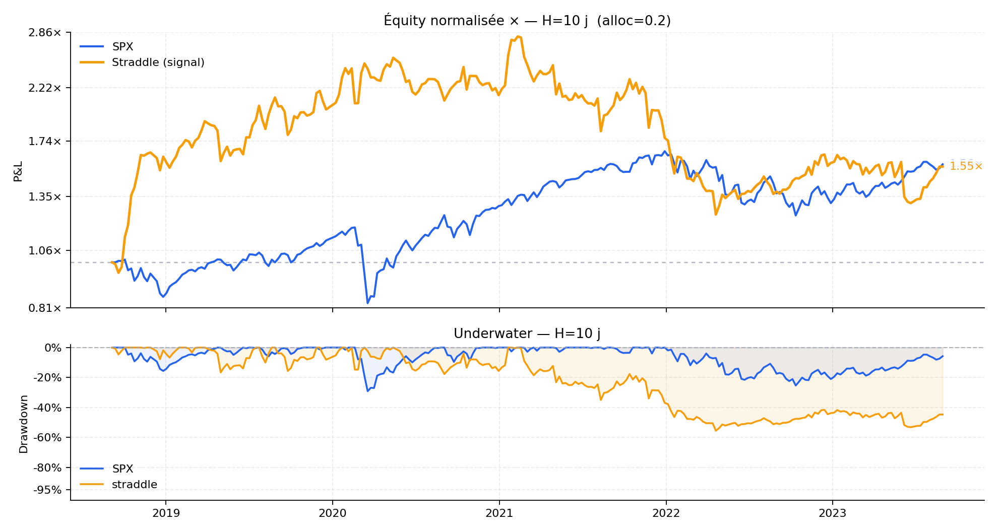
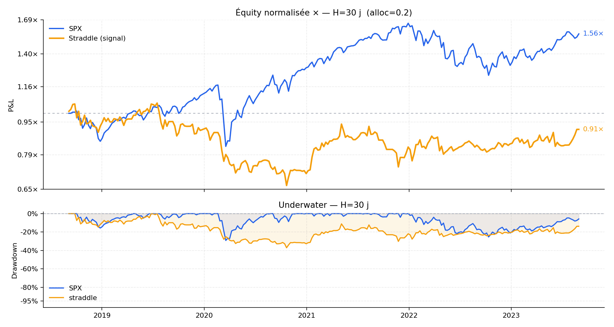
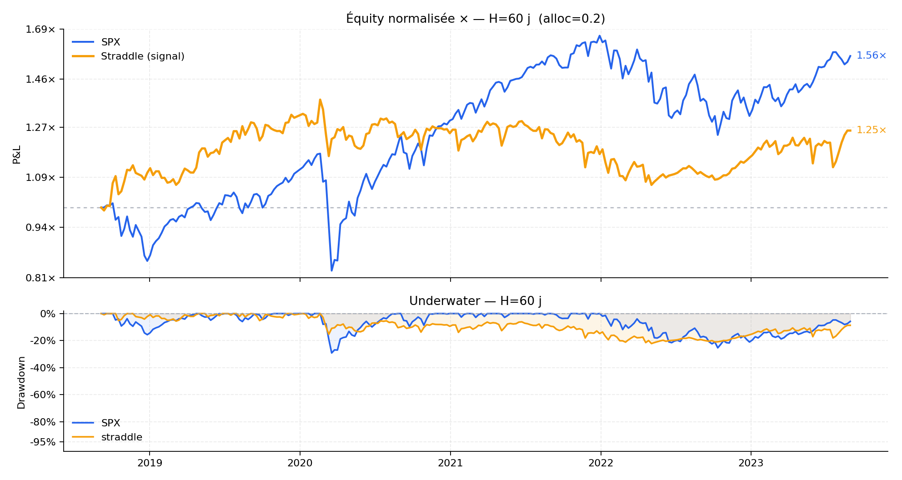
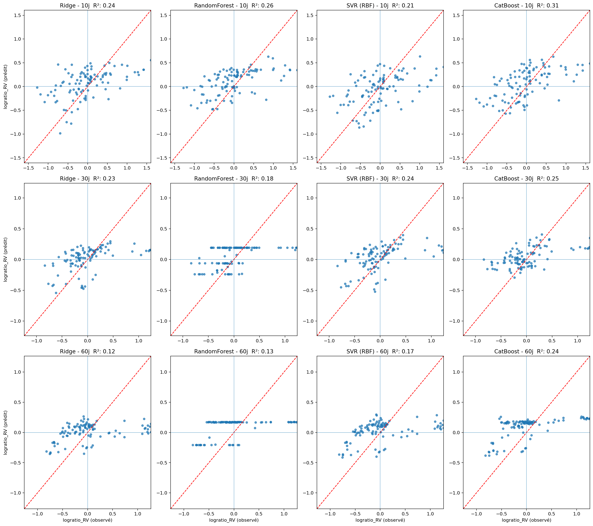

# ML Volatility Trading Using Long and Short Straddles

Ce projet a été réalisé dans le cadre du cours **Méthodes d’apprentissage appliquées aux données financières (MATH 60610)** à HEC Montréal.

L’objectif est de prédire les écarts entre la volatilité implicite et la volatilité réalisée du S&P 500 sur des horizons de **10, 30 et 60 jours**, puis d’utiliser ces prévisions pour générer des signaux de trading sur des straddles ATM.

Le projet combine plusieurs techniques d’apprentissage automatique, notamment **CatBoost, Ridge, Random Forest, SVR, régression logistique et K-means**. Les modèles utilisent des données provenant du SPX, des options, de la structure de volatilité et de plusieurs variables macroéconomiques.

Les modèles sont entraînés et validés sur la période **2010–2018**, puis la stratégie est testée hors échantillon entre **2018 et 2023**.

Le dépôt contient le code de préparation des données, d’entraînement des modèles, de classification des signaux et de backtest.

## Résultats

Les performances hors échantillon obtenues entre 2018 et 2023 sont résumées ci-dessous.

| Horizon | Valeur finale | CAGR | Sharpe |
|---|---:|---:|---:|
| 10 jours | 1.52x | 8.74% | 0.42 |
| 30 jours | 0.95x | -1.11% | 0.04 |
| 60 jours | 1.25x | 4.51% | 0.37 |
| S&P 500 | 1.56x | 9.38% | 0.56 |

Les résultats détaillés sont disponibles dans [`results/backtest_summary.csv`](results/backtest_summary.csv).

### Backtests

#### Horizon 10 jours



#### Horizon 30 jours



#### Horizon 60 jours



### Validation des modèles de régression



## Structure du projet

```text
.
├── src/
│   ├── Dataset_builder.py
│   ├── Regression.py
│   ├── classification.py
│   └── backtest.py
├── data/
├── results/
│   ├── backtest_summary.csv
│   └── figures/
│       ├── backtest_H10.png
│       ├── backtest_H30.png
│       ├── backtest_H60.png
│       └── regression_validation.png
├── docs/
│   └── Rapport_final_MATH60610_TPA.pdf
├── README.md
├── requirements.txt
└── .gitignore
